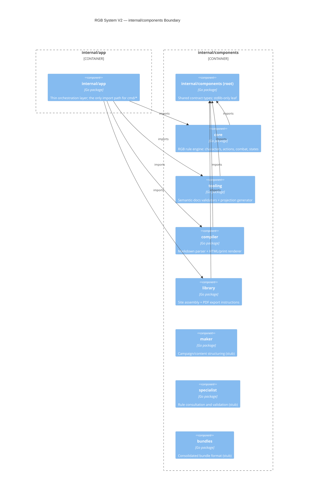

# Components

This diagram matches, not just illustrates, what
`tests/architecture/architecture_test.go` mechanically enforces
(`TestComponentsDoNotImportOuterLayers`, `TestComponentsDoNotImportSiblings`,
`TestSharedContractStaysLeaf`, `TestEntrypointsGoThroughApp`) and what
`.golangci.yml`'s `depguard` rules repeat:

- Every arrow shown above is allowed. Any arrow **not** shown — most
  importantly, any edge directly between two sibling components under
  `internal/components/` (e.g. `compiler` importing `tooling`) — is
  forbidden and fails both the linter and `make test-arch`.
- `internal/components` (the root/contract package) must stay a leaf:
  it may depend on the standard library only, never on `app`, `cmd`, or
  any sibling component.
- `cmd/*` binaries may only import `internal/app` — never
  `internal/components/*` directly.

← [Back to Architecture Index](README.md)
