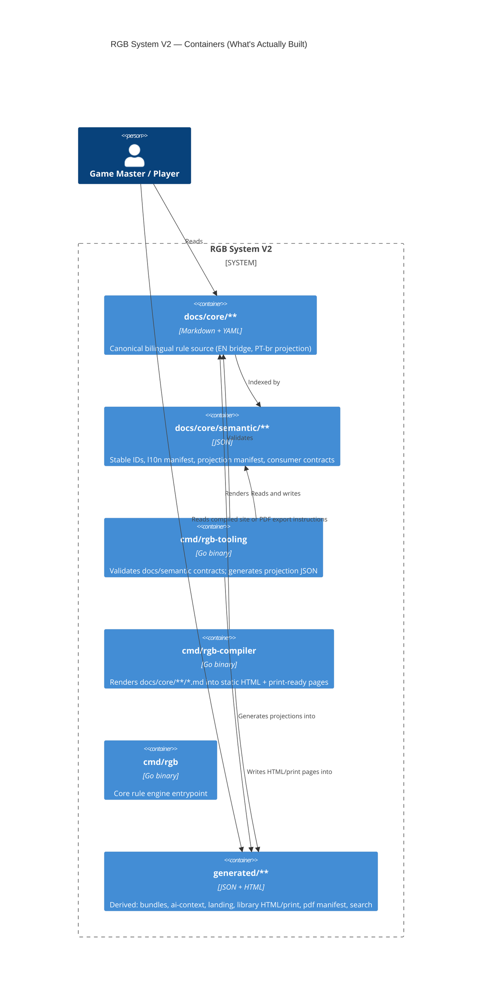

# Containers

`cmd/rgb` (the Core rule engine entrypoint) does not yet consume
`docs/core/**` at runtime — RGB Core V2's rule logic lives in
`internal/components/core` and is validated against canonical docs via
Gherkin/BDD tests (`tests/features/`, `tests/core_behavior/`), not by
`cmd/rgb` reading Markdown directly. This is shown as a separate,
currently-unconnected container rather than omitted, since it is a real,
built binary.

← [Back to Architecture Index](README.md)
