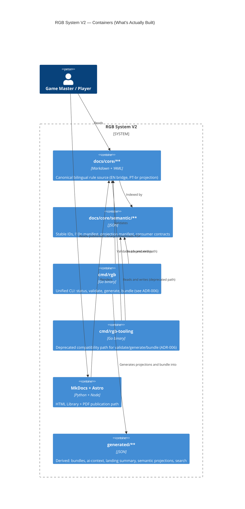

# Containers

`cmd/rgb` does not yet consume `docs/core/**` at runtime for rule
resolution — RGB Core V2's rule logic lives in `internal/components/core`
and is validated against canonical docs via Gherkin/BDD tests
(`tests/features/`, `tests/core_behavior/`), not by `cmd/rgb` reading
Markdown directly. Its `validate`/`generate`/`bundle` subcommands do read
and write `docs/**` and `generated/**`, as shown above; only rule-engine
consumption of docs at runtime is still absent.

`cmd/rgb-tooling` is deprecated, not removed — see
[ADR-006](../adr/adr-006-unified-cli-topology.md) for the compatibility
decision and M006 removal requirement. The former Go-rendered
HTML/print/PDF pipeline (`cmd/rgb-compiler`, `internal/components/compiler`,
`internal/components/library`) is no longer the public publication path.
MkDocs + Astro owns HTML Library and PDF publication.

← [Back to Architecture Index](README.md)
