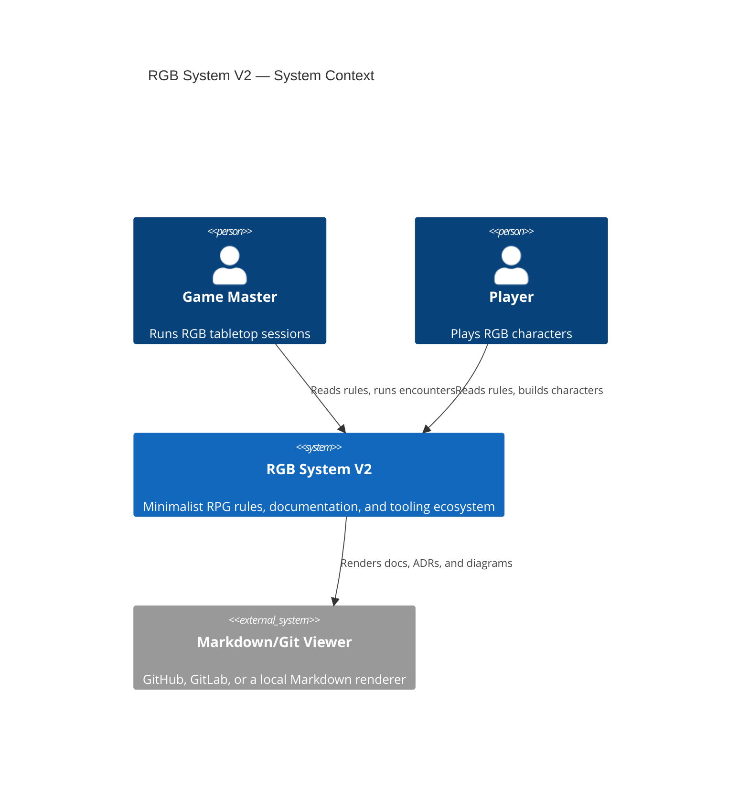

# System Context

RGB System V2 is a single, self-contained system from the outside: no
external services, no network dependencies, no accounts. Game Masters and
Players interact with it entirely by reading documentation and (for
Tooling contributors) running local Go binaries.

← [Back to Architecture Index](README.md)
